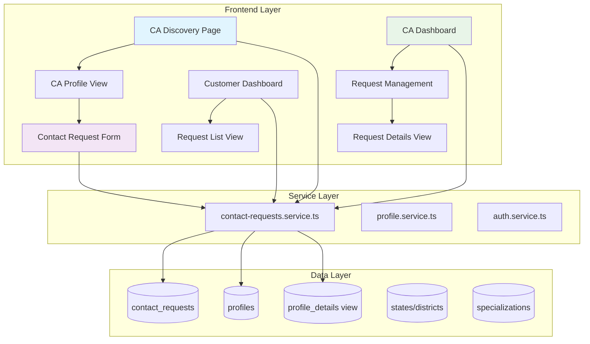
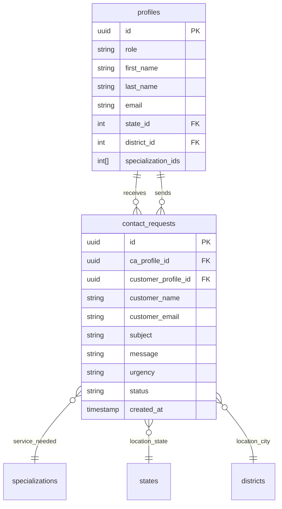

# Design Document

## Overview

The Contact Requests feature enables seamless communication between customers and Chartered Accountants (CAs) on the Audit-it platform. The system leverages the existing database schema with the `contact_requests` table and follows the established architectural patterns using Next.js 15, React 19, TypeScript, Supabase, and TanStack Query.

The design emphasizes mobile-first responsive UI with neumorphic design principles, comprehensive type safety, and efficient data management through normalized database relationships and optimized caching strategies.

## Architecture

### System Components



### Data Flow Architecture

1. **CA Discovery Flow**: Customer → CA List → Profile View → Contact Form → Request Submission
2. **Request Management Flow**: CA → Dashboard → Request List → Request Details → Response/Status Update
3. **Customer Tracking Flow**: Customer → Dashboard → Request List → Request Details → Status Monitoring

### Technology Stack Integration

- **Frontend**: Next.js 15 App Router with React 19 and TypeScript
- **State Management**: TanStack Query for server state, Jotai for client state
- **Database**: Supabase PostgreSQL with Row Level Security (RLS)
- **UI Framework**: shadcn/ui with neumorphic design system
- **Form Management**: React Hook Form with Zod validation
- **Styling**: Tailwind CSS with custom neumorphic utilities

## Components and Interfaces

### Core Components Structure

```
src/components/contact-requests/
├── discovery/
│   ├── CADiscoveryPage.component.tsx          # Main CA search and filter page
│   ├── CAProfileCard.component.tsx            # CA profile card in search results
│   ├── CAProfileView.component.tsx            # Detailed CA profile view
│   └── SearchFilters.component.tsx            # Location/specialization filters
├── forms/
│   ├── ContactRequestForm.component.tsx       # Contact request submission form
│   └── ContactRequestFormFields.component.tsx # Reusable form field components
├── customer/
│   ├── CustomerRequestsDashboard.component.tsx # Customer's request management
│   ├── CustomerRequestCard.component.tsx       # Individual request card
│   └── CustomerRequestDetails.component.tsx    # Detailed request view
├── ca/
│   ├── CARequestsDashboard.component.tsx       # CA's request management
│   ├── CARequestCard.component.tsx             # CA view of request card
│   ├── CARequestDetails.component.tsx          # CA detailed request view
│   └── CARequestResponse.component.tsx         # CA response form
└── shared/
    ├── RequestStatusBadge.component.tsx        # Status indicator component
    ├── UrgencyIndicator.component.tsx          # Urgency level display
    └── RequestAnalytics.component.tsx          # Analytics dashboard
```

### Component Specifications

#### CADiscoveryPage.component.tsx

- **Purpose**: Main CA discovery interface with search and filtering
- **Props**: `initialFilters?: SearchFilters, location?: LocationFilter`
- **Features**: Infinite scroll, real-time search, location-based filtering
- **Size Limit**: <200 lines including imports

#### ContactRequestForm.component.tsx

- **Purpose**: Form for customers to submit contact requests
- **Props**: `caProfile: ProfileDetails, onSuccess: (request: ContactRequest) => void`
- **Validation**: Zod schema with comprehensive field validation
- **Features**: Auto-populated customer info, service type selection, urgency levels

#### CARequestsDashboard.component.tsx

- **Purpose**: CA's main interface for managing incoming requests
- **Props**: `caId: string, initialFilters?: RequestFilters`
- **Features**: Status filtering, urgency sorting, bulk actions, analytics overview
- **Real-time**: Live updates for new requests

### Interface Definitions

```typescript
// Core Contact Request Types
export interface ContactRequest {
  id: string;
  ca_profile_id: string;
  customer_profile_id?: string;
  customer_name: string;
  customer_email: string;
  customer_phone?: string;
  subject: string;
  message: string;
  service_needed?: string;
  urgency: UrgencyLevel;
  location_city?: string;
  location_state?: string;
  status: ContactRequestStatus;
  ca_private_notes?: string[];
  replied_at?: string;
  created_at: string;
  updated_at: string;
}

// Extended interface with resolved relationships
export interface ContactRequestDetails extends ContactRequest {
  ca_profile: ProfileDetails;
  customer_profile?: ProfileDetails;
  service_specialization?: SpecializationWithCategory;
}

// Form interfaces
export interface ContactRequestFormData {
  subject: string;
  message: string;
  service_needed?: string;
  urgency: UrgencyLevel;
  customer_phone?: string;
  location_city?: string;
  location_state?: string;
}

// Filter and search interfaces
export interface ContactRequestFilters {
  status?: ContactRequestStatus[];
  urgency?: UrgencyLevel[];
  dateRange?: { start: string; end: string };
  serviceType?: string[];
}

export interface CADiscoveryFilters {
  location?: { stateId?: number; districtId?: number };
  specializations?: number[];
  languages?: number[];
  verified?: boolean;
  searchQuery?: string;
}
```

## Data Models

### Database Schema Integration

The design leverages the existing `contact_requests` table from migration `001-base.sql`:

```sql
CREATE TABLE public.contact_requests (
  id uuid NOT NULL DEFAULT uuid_generate_v4() PRIMARY KEY,
  ca_profile_id uuid NOT NULL REFERENCES public.profiles(id),
  customer_profile_id uuid REFERENCES public.profiles(id), -- NULL for anonymous
  customer_name text NOT NULL,
  customer_email text NOT NULL,
  customer_phone text,
  subject text NOT NULL,
  message text NOT NULL,
  service_needed text,
  urgency text NOT NULL,
  location_city text,
  location_state text,
  status text NOT NULL DEFAULT 'new',
  ca_private_notes text[],
  replied_at timestamp with time zone,
  created_at timestamp with time zone NOT NULL DEFAULT now(),
  updated_at timestamp with time zone NOT NULL DEFAULT now()
);
```

### Data Relationships



### Optimized Database Views

Create a new database view for efficient contact request queries:

```sql
CREATE OR REPLACE VIEW contact_requests_with_details AS
SELECT
    cr.*,
    -- CA Profile Details
    ca.first_name as ca_first_name,
    ca.last_name as ca_last_name,
    ca.profile_picture_url as ca_profile_picture,
    ca.bio as ca_bio,
    ca_state.name as ca_state_name,
    ca_district.name as ca_district_name,
    -- Customer Profile Details (if available)
    customer.first_name as customer_first_name,
    customer.last_name as customer_last_name,
    customer.profile_picture_url as customer_profile_picture,
    -- Specialization Details
    ARRAY(
        SELECT s.name
        FROM specializations s
        WHERE s.code = cr.service_needed
    ) as service_specialization_names
FROM contact_requests cr
LEFT JOIN profiles ca ON cr.ca_profile_id = ca.id
LEFT JOIN profiles customer ON cr.customer_profile_id = customer.id
LEFT JOIN states ca_state ON ca.state_id = ca_state.id
LEFT JOIN districts ca_district ON ca.district_id = ca_district.id;
```

## Error Handling

### Comprehensive Error Management

```typescript
// Error types for contact requests
export enum ContactRequestErrorType {
  VALIDATION_ERROR = "VALIDATION_ERROR",
  PERMISSION_DENIED = "PERMISSION_DENIED",
  CA_NOT_FOUND = "CA_NOT_FOUND",
  REQUEST_NOT_FOUND = "REQUEST_NOT_FOUND",
  RATE_LIMIT_EXCEEDED = "RATE_LIMIT_EXCEEDED",
  NETWORK_ERROR = "NETWORK_ERROR",
  UNKNOWN_ERROR = "UNKNOWN_ERROR",
}

export interface ContactRequestError {
  type: ContactRequestErrorType;
  message: string;
  field?: string;
  code?: string;
}

// Error handling in service layer
export class ContactRequestService {
  private handleError(error: unknown): ContactRequestError {
    if (error instanceof Error) {
      // Supabase specific errors
      if (error.message.includes("PGRST")) {
        return {
          type: ContactRequestErrorType.PERMISSION_DENIED,
          message: "You do not have permission to perform this action",
        };
      }

      // Network errors
      if (error.message.includes("fetch")) {
        return {
          type: ContactRequestErrorType.NETWORK_ERROR,
          message: "Network connection failed. Please check your internet connection.",
        };
      }
    }

    return {
      type: ContactRequestErrorType.UNKNOWN_ERROR,
      message: "An unexpected error occurred. Please try again.",
    };
  }
}
```

### Form Validation with Zod

```typescript
import { z } from "zod";

export const contactRequestSchema = z.object({
  subject: z
    .string()
    .min(5, "Subject must be at least 5 characters")
    .max(100, "Subject must be less than 100 characters"),
  message: z
    .string()
    .min(20, "Message must be at least 20 characters")
    .max(1000, "Message must be less than 1000 characters"),
  service_needed: z.string().optional(),
  urgency: z.enum(["low", "medium", "high", "urgent"]),
  customer_phone: z
    .string()
    .regex(/^[+]?[\d\s-()]+$/, "Invalid phone number format")
    .optional(),
  location_city: z.string().max(50).optional(),
  location_state: z.string().max(50).optional(),
});

export type ContactRequestFormData = z.infer<typeof contactRequestSchema>;
```

## Testing Strategy

### Component Testing Approach

```typescript
// Example test structure for ContactRequestForm.component.tsx
describe("ContactRequestForm", () => {
  const mockCAProfile = createMockCAProfile();
  const mockOnSuccess = jest.fn();

  beforeEach(() => {
    jest.clearAllMocks();
  });

  describe("Form Validation", () => {
    it("should validate required fields", async () => {
      render(<ContactRequestForm caProfile={mockCAProfile} onSuccess={mockOnSuccess} />);

      fireEvent.click(screen.getByRole("button", { name: /send request/i }));

      expect(await screen.findByText(/subject must be at least 5 characters/i)).toBeInTheDocument();
      expect(await screen.findByText(/message must be at least 20 characters/i)).toBeInTheDocument();
    });

    it("should pre-populate customer information for authenticated users", () => {
      const mockUser = createMockAuthenticatedUser();
      render(
        <AuthProvider user={mockUser}>
          <ContactRequestForm caProfile={mockCAProfile} onSuccess={mockOnSuccess} />
        </AuthProvider>
      );

      expect(screen.getByDisplayValue(mockUser.email)).toBeInTheDocument();
      expect(screen.getByDisplayValue(`${mockUser.first_name} ${mockUser.last_name}`)).toBeInTheDocument();
    });
  });

  describe("Form Submission", () => {
    it("should submit valid form data", async () => {
      const mockSubmit = jest.spyOn(contactRequestService, "createContactRequest");
      mockSubmit.mockResolvedValue(createMockContactRequest());

      render(<ContactRequestForm caProfile={mockCAProfile} onSuccess={mockOnSuccess} />);

      await fillValidFormData();
      fireEvent.click(screen.getByRole("button", { name: /send request/i }));

      await waitFor(() => {
        expect(mockSubmit).toHaveBeenCalledWith(
          expect.objectContaining({
            ca_profile_id: mockCAProfile.id,
            subject: "Test Subject",
            message: "Test message content",
          })
        );
      });
    });
  });
});
```

### Service Layer Testing

```typescript
// Example test for contact-requests.service.ts
describe("ContactRequestService", () => {
  describe("createContactRequest", () => {
    it("should create contact request with valid data", async () => {
      const mockData = createMockContactRequestData();
      const mockResponse = createMockContactRequest();

      jest.spyOn(supabase, "from").mockReturnValue({
        insert: jest.fn().mockReturnValue({
          select: jest.fn().mockReturnValue({
            single: jest.fn().mockResolvedValue({ data: mockResponse, error: null }),
          }),
        }),
      } as any);

      const result = await createContactRequest(mockData);

      expect(result).toEqual(mockResponse);
    });

    it("should handle database errors gracefully", async () => {
      const mockError = new Error("Database connection failed");

      jest.spyOn(supabase, "from").mockReturnValue({
        insert: jest.fn().mockReturnValue({
          select: jest.fn().mockReturnValue({
            single: jest.fn().mockRejectedValue(mockError),
          }),
        }),
      } as any);

      await expect(createContactRequest(createMockContactRequestData())).rejects.toThrow(
        "Unable to send contact request. Please try again."
      );
    });
  });
});
```

### Integration Testing

```typescript
// End-to-end flow testing
describe("Contact Request Flow", () => {
  it("should complete full customer-to-CA contact flow", async () => {
    // 1. Customer discovers CA
    render(<CADiscoveryPage />);

    // 2. Customer views CA profile
    fireEvent.click(screen.getByText("View Profile"));
    await waitFor(() => screen.getByText("Contact CA"));

    // 3. Customer submits contact request
    fireEvent.click(screen.getByText("Contact CA"));
    await fillContactForm();
    fireEvent.click(screen.getByText("Send Request"));

    // 4. Verify request creation
    await waitFor(() => {
      expect(screen.getByText(/request sent successfully/i)).toBeInTheDocument();
    });

    // 5. CA receives and responds to request
    render(<CARequestsDashboard caId='test-ca-id' />);
    await waitFor(() => screen.getByText("New Request"));

    fireEvent.click(screen.getByText("Reply"));
    await fillResponseForm();
    fireEvent.click(screen.getByText("Send Response"));

    // 6. Verify response recorded
    await waitFor(() => {
      expect(screen.getByText(/response sent/i)).toBeInTheDocument();
    });
  });
});
```

### Performance Testing

- **Component Rendering**: Measure render times for large request lists
- **Query Performance**: Test database query execution times with large datasets
- **Memory Usage**: Monitor memory consumption during infinite scroll
- **Network Optimization**: Verify efficient data fetching and caching

### Accessibility Testing

- **Screen Reader Compatibility**: Test with NVDA, JAWS, and VoiceOver
- **Keyboard Navigation**: Ensure all interactive elements are keyboard accessible
- **Color Contrast**: Verify WCAG AA compliance for all text and UI elements
- **Focus Management**: Test focus trapping in modals and form navigation

The testing strategy ensures comprehensive coverage across all layers of the application while maintaining the established patterns and quality standards of the Audit-it platform.
